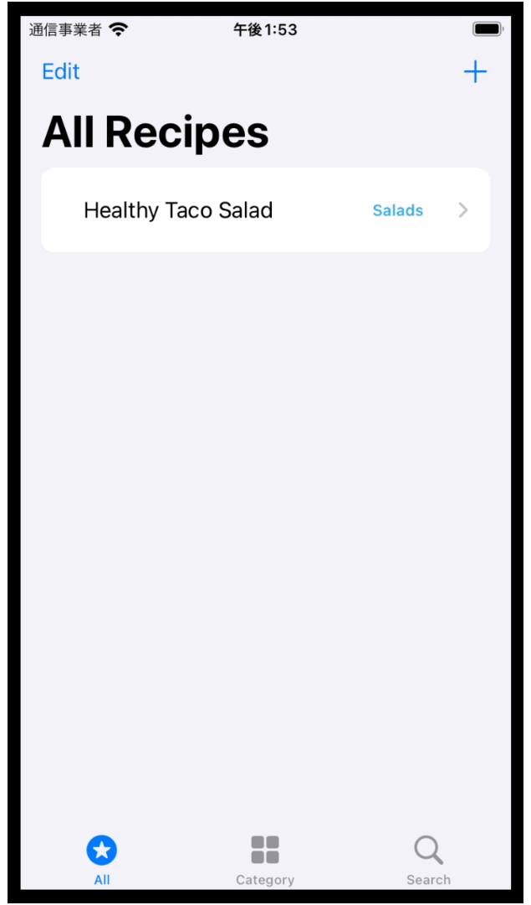
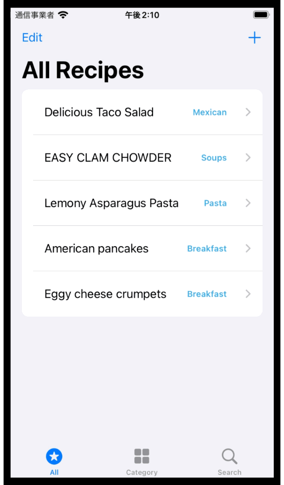
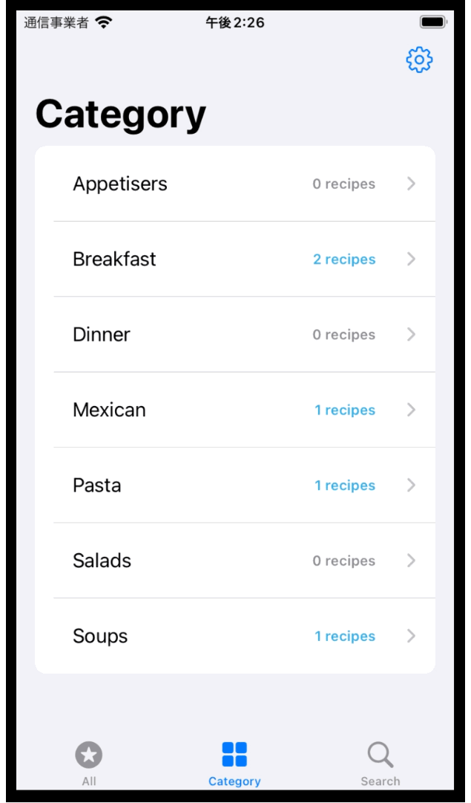
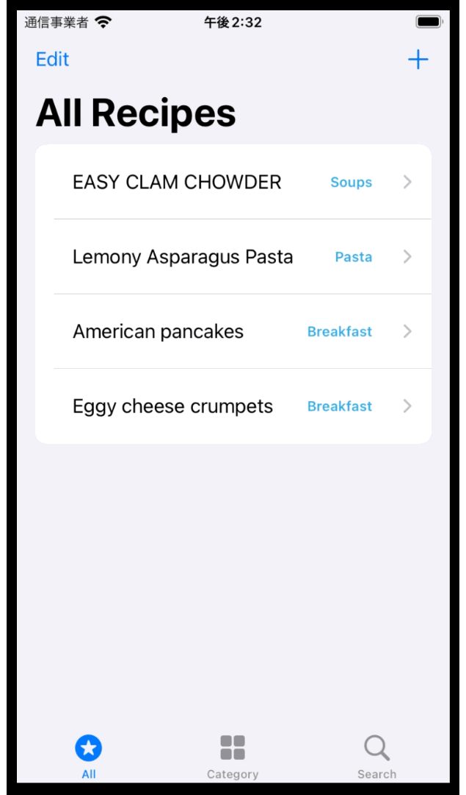

# RecipesOrganiser
**RecipesOrganiser** is an iOS app that helps organise a volume of user's favourite recipe sites. 
It's suitable for a quick look-up for recipes which can be categorised as you like and searched for by keywords.

## Description
Major functions:
- Add / edit / delete favourite recipe sites.
- Browse a list of favourite recipes and view the web page.
- Add / edit / delete your own categories to organise recipes.
- View a list of recipes under a given category.
- Search for registered recipes by a keyword.

## How It Works
### 1. Add the first recipe & View the recipe web page
Start using this app by tapping the *Add Recipe* button. On the screen that follows, simply enter name, URL and select category for the recipe to add. Once the recipe is added, you can view it on the web page through this app.

### 2. Edit a recipe & Add a new category
You can edit the recipe name, URL and category. To edit them, tap the *Edit* button on top of *All Recipes* view and then from the list choose the recipe that you want to edit.

The app comes with some default recipe categories. If you can't find a suitable one, simply add a new category on *Customise Categories* view to which you can be navigated from *Add Recipe* or *Edit Recipe* view.

The following demonstrates how a recipe is edited and a new category is created for the recipe.

### 3. View category list
All recipes are designed to belong to a category to help users find a desired recipe. The list of all categories can be viewed by choosing the *Category* tab at the bottom. If you have a category in mind, such as *Breakfast* as in the demonstration below, the app navigates you to the recipe of the category just by following the UI.

### 4. Use search bar
To find recipes you can use the search bar through the *Search* tab. As you type in a keyword, such as recipe name and category name, the app suggests candidates below the search bar.

### 5. Add & Delete categories
The *Customise Categories* view allows you to add and delete categories. There are four restrictions in terms of the addition and deletion:

- A category can't be added if it already exists.
- The total number of categories cannot exceed 30.
- A category can't be deleted if there exists a recipe under the category.
- If there is only one category, it can't be deleted.

An alert window would appear in these situations.

### 6. Delete recipes
In the *All Recipes* view, the recipes can be deleted in the *Edit* mode as shown below, or just by swiping the list row from right to left.

## Installation
Clone this repository, simply open it on Xcode and run using iOS Simulator.
